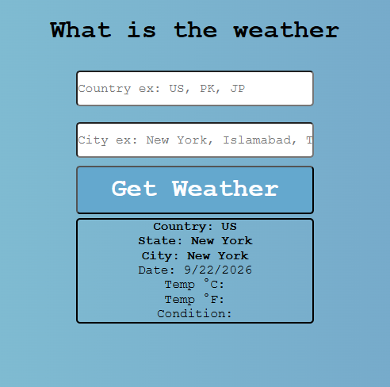
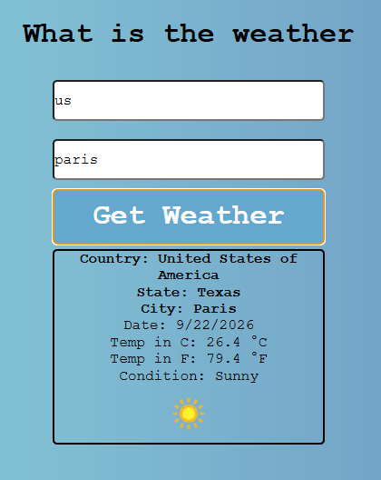

# Weather App

Goal: Enable your user to enter a city + country and return the temperature in Fahrenheit.

## View

  
  

## Built With

- HTML5
- CSS3
- Vanilla JavaScript

## Local Preview

Open `index.html` using the VS Code Live Server extension or open the file directly in your browser.

## Before Publishing

Replace any placeholder APIs.

